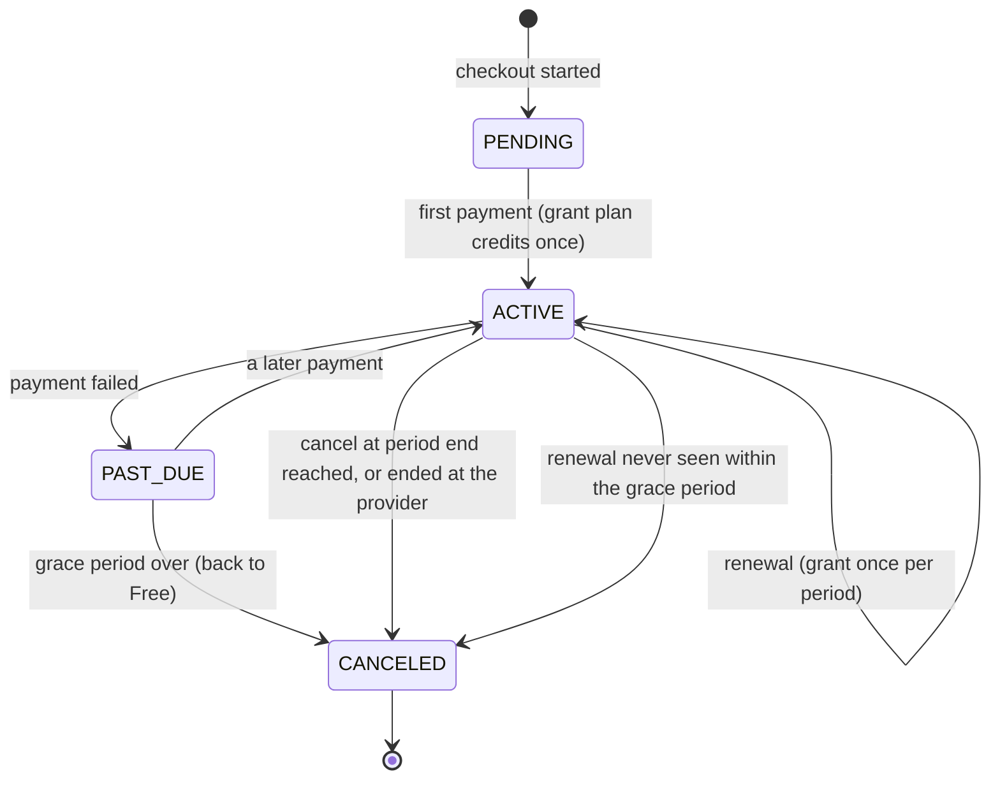

# 0036. Plans, credits and payments (Paystack and Stripe)

## Status
Accepted

## Context
P6.1 (`PLAN.md` section 5 billing, section 7 cost control, D8, Phase 6). Until now credits were only debited
(`AI_USAGE`, ADR 0025): the balance ran negative and the per-user daily cap was the only limiter. This task makes
credits real: plans grant them, usage spends them, the gate enforces the balance, and users can pay for a plan or a
credit pack through a hosted checkout (Paystack for NGN, Stripe for USD).

The product decisions came with the task and are recorded here, not re-argued: two plans (Free, Pro) with amounts,
prices and provider ids in configuration; a Free grant once per calendar month per user (job plus lazy grant in the
gate); the gate requires a balance above zero and a daily cap not reached, answered with HTTP 402
`insufficient-credits`; the providers behind a port with two thin HTTP adapters and WireMock tests; signed, idempotent
webhooks; a subscription lifecycle with a grace period; one-off top-ups that never expire; an authenticated API and a
web billing page; account deletion that also stops the remote subscription.

## Decision

### Data (migration `V32__plans_and_payments.sql`; `V22` is untouched)
- **`plans`** (`id`, `code`, `name`, `monthly_credits`, `active`), seeded with `free` (300) and `pro` (6000). The
  seeded `monthly_credits` is only the default: `app.billing.plans.<code>.monthly-credits` overrides it, and the **prices**
  exist only in configuration (per currency: provider, amount in minor units, provider plan/price id). The shipped
  defaults are obviously fake placeholders (amount 100, ids containing `PLACEHOLDER`).
- **`credit_ledger`** gains `PLAN_GRANT`, `TOPUP`, `REFUND_ADJUSTMENT` (as specified) and `PLAN_EXPIRY` (see Rollover), an
  `idempotency_key` (UNIQUE) and `topup_after`. Sign and key rules are CHECK constraints: grants and top-ups are
  positive, usage and expiry negative, and grants, expiries and top-ups must carry a key. Append-only still holds (the
  V22 trigger rejects UPDATE).
- **`subscriptions`** (`user_id`, `plan_id`, `provider`, `provider_ref`, `status`, `current_period_end`,
  `cancel_at_period_end`, `created_at`, `updated_at`, plus `provider_customer`, `past_due_since`, `last_event_at`). Statuses:
  `PENDING` (checkout started), `ACTIVE`, `PAST_DUE`, `CANCELED`. A partial unique index allows one `ACTIVE` or `PAST_DUE`
  row per user; `(provider, provider_ref)` is unique where set. A user with no live row is on Free.
- **`webhook_events`** (`provider`, `event_id`, `event_type`, `received_at`) with `UNIQUE (provider, event_id)`: provider ids
  only, nothing about a person.
- **`remote_cancellations`** (`provider`, `provider_ref`, `attempts`, `next_attempt_at`): subscriptions that could not be
  stopped at the provider when an account was deleted. Provider ids only, no user column.

### One writer for the ledger, exact under concurrency
`CreditLedgerStore.append` is the only writer of ledger lines. It takes the per-user `pg_advisory_xact_lock` (as
ADR 0025's debit did, now shared by every kind of line), computes `balance_after` from the previous line, and inserts with
`ON CONFLICT (idempotency_key) DO NOTHING`; it reports whether it wrote. Grants and top-ups use these keys:

| Line | Key |
|---|---|
| Free grant | `free:<userId>:<yyyy-MM>` (calendar month, UTC) |
| Paid period | `plan:<subscriptionId>:<period end, epoch seconds>` |
| Top-up | `topup:<provider>:<payment reference>` |
| Expiry | `expiry:<the grant's key>` |

A duplicate webhook, a retried job and two racing lazy grants therefore write once (tests run all three, including eight
concurrent callers).

### The gate (decision 4)
`AiUsageGate.requireAllowance` first grants the Free credits of the current month if the user has none yet and is not on a
paid plan (the lazy grant: existing users get their first grant on first use, and a missed monthly run strands nobody), then
requires **balance > 0 and the daily cap not reached**. The balance is reported before the cap: it is the one a user can
fix by paying. At zero it throws `InsufficientCreditsException`: HTTP **402**, problem `type`
`urn:jobfinder:problem:insufficient-credits`, stable `code: insufficient_credits`, and a `balance` member. The cap keeps its
429 `ai_daily_cap_reached`. Both extend a new `AiAllowanceException`, which is what callers that handle "blocked by
allowance" catch (matching falls back to stage-2 scores with the new `INSUFFICIENT_CREDITS` reason, the resume worker stores
`insufficient_credits`, an application pack part is reported blocked, embeddings skip the owner). `AiUsageGate.status` gives
the same answer without throwing.

**Documented overshoot.** The check is before the call. A call that was allowed may cost more than the balance has left, and
calls in flight together can each pass the check: the balance may go below zero, by at most what the calls in flight cost
(the same bounded overshoot as the cap in ADR 0025). Usage that was already billed is always recorded, whatever the balance;
the next call is refused, and the next grant first pays the debt off. Existing AI-flow tests needed no seeded balance: the
lazy grant gives every test user the Free credits on first use.

### Rollover (decision 3)
Credits do not roll over beyond `app.billing.rollover-cap-credits` (**default 0: no rollover**). When a period's grant is
written, the unspent plan credits above the cap expire first, as their own `PLAN_EXPIRY` line in the same transaction (so
the history shows both, and a Free user's ledger reads: expiry, grant). This needs to know which part of the balance is
plan credit, hence `topup_after`: the part of `balance_after` that comes from top-ups. A top-up raises it; any other line
lowers it only if the balance falls below it (spending uses plan credits first). **Top-ups never expire.** The first payment
of a subscription does not expire anything (upgrading never costs a user their remaining free credits); renewals and monthly
Free grants do. A negative balance is not expired, it is added to. `PLAN_EXPIRY` is the one reason beyond the three the task
listed; expiring inside the grant line would have made grants of 0 or negative size.

### Providers behind a port, no vendor SDK (decision 5)
`PaymentProvider` has two adapters, `StripeProvider` and `PaystackProvider`, each a thin `RestClient` with the timeouts of
the other clients: Stripe Checkout Session (`mode=subscription` with the configured price id, or `mode=payment` with inline
`price_data` for a pack), Stripe `cancel_at_period_end`; Paystack `transaction/initialize` (with the configured `plan` code
for a subscription) and `subscription/disable`. **No SDK**: each provider is two or three calls and one signature scheme,
an SDK would add a large transitive dependency tree and its own HTTP stack and retry behaviour next to the ones we already
configure, and card data is not involved (hosted checkout only, nothing card-related is ever sent, stored or logged). Keys
and secrets come from the environment; tests use fake ones and WireMock, and no test calls a real provider. A provider is
**offered only when its keys are set** (Stripe needs its API key and its webhook secret: an API key alone could take
payments we would never hear of).

The checkout carries our identifiers as metadata (`jf_user`, `jf_kind`, `jf_item`), which come back signed in the webhook;
nothing about a payment is trusted from the browser's return.

### Webhooks (decision 6)
`POST /webhooks/stripe` and `POST /webhooks/paystack` have a filter chain of their own (ahead of the JWT chain, like
`/internal/**`): no JWT, no session, CSRF off, nothing else reachable. The controller takes the **raw body bytes**.
- **Stripe**: `Stripe-Signature: t=...,v1=...`, HMAC-SHA256 over `t + "." + body`, any `v1` may match (rotation), timestamp
  within `app.billing.stripe.webhook-tolerance` (5 minutes) of now.
- **Paystack**: `x-paystack-signature`, HMAC-SHA512 over the body with the secret key. Paystack sends no timestamp, so age
  cannot be checked; idempotency makes a replay harmless instead.
- Comparison is constant time (`MessageDigest.isEqual`); a bad or missing signature is a bare **400**, with no body.
- The signature is verified **before** the body is parsed. Only the event id and type are ever logged.
- **Idempotency**: in one transaction the event is claimed in `webhook_events` and applied. A duplicate finds the claim and
  changes nothing (200). If applying fails, the claim rolls back with it, so the provider's redelivery is processed afresh.
  Event types billing does not act on are acknowledged with 200, counted in the `billing.webhooks{provider,outcome}` metric
  and not stored. Paystack events carry no id: the id is the SHA-256 of the raw body, which a redelivery repeats exactly.
- **Unmatched events**: an event that needs its companion first (an invoice before the checkout that links it, a Paystack
  `subscription.create` before the payment that made it) is answered **503** so the provider redelivers it; nothing is marked
  handled. Stripe's invoice carries the user in the subscription's metadata, so it needs no companion at all.

### Subscription lifecycle (decision 7)

- **Moving only forward.** A payment moves a subscription on only if it covers a later period than the one on record (or the
  same period and a later event time). A failure, a cancel flag or an end is applied only if it is not older than the newest
  event already applied (`last_event_at`). So a delayed or replayed event can never turn an active subscription back into
  past-due or canceled. A payment event for an older period changes no state, and still credits its period if (and only if)
  that was missed.
- **Failure and grace.** `PAST_DUE` keeps the paid plan during `app.billing.grace-period` (default 3 days); the expiry job
  then moves the user to Free and stops the remote subscription, best effort. Credits already granted stay (until used or
  expired by the next grant per Rollover).
- **User cancel** (`POST /billing/subscription/cancel`, idempotent): stops renewal at the provider (Stripe
  `cancel_at_period_end`; Paystack has no such thing, so `disable` stops future charges and we keep access ourselves until the
  period ends), sets `cancel_at_period_end`, and the expiry job moves the user to Free at the period end.
- **Periods.** Stripe's invoice line gives the period. Paystack plans are monthly: a successful charge covers one calendar
  month from `paid_at`. A first Paystack payment is matched to its user by our metadata, later ones (which carry none) by the
  Paystack customer code stored on the subscription.
- A second paid subscription for a user who has one is ignored (logged); checkout refuses it up front (409
  `already_subscribed`). Refunding such a payment is a manual step.
- `REFUND_ADJUSTMENT` exists in the ledger for manual corrections; nothing writes it automatically, and refund webhooks are
  not handled in this task.

### Jobs (decision 3, 7)
- **Free grant**: daily, grants every active, verified, undeleted user without a live paid plan the month's credits they do
  not have yet. It writes through the same `CreditGrants.grantFreeIfDue` as the lazy grant, so running it twice, or after the
  gate already granted, changes nothing.
- **Expiry**: hourly, ends overdue subscriptions (see lifecycle) and retries `remote_cancellations` with a growing delay.
- Both run under ShedLock (an optimisation, not what makes them safe) and are off with `app.billing.jobs.enabled=false`.

### Top-ups (decision 8)
Packs are configuration (id, credits, price per currency). The same hosted checkout, in payment mode. Credited once, on the
success webhook, under `topup:<provider>:<payment reference>`; Stripe may send both `checkout.session.completed` and
`checkout.session.async_payment_succeeded` for one payment, which is why the key is the payment, not the event.

### API (decision 9), all authenticated and about the caller only (the user comes from the token; no parameter names a user)
| Endpoint | Purpose |
|---|---|
| `GET /billing/plans` | plans and packs with the prices of the providers that are switched on |
| `GET /billing/me` | plan, status, period end, balance, what this period granted and used, today's cap and usage (also gives a Free user this month's credits if due) |
| `POST /billing/checkout` `{plan or pack, provider}` | hosted checkout URL; 400 `provider_not_offered`, 404, 409 `already_subscribed`, 429, 502 `payment_provider_unavailable` |
| `POST /billing/subscription/cancel` | idempotent; 200 with the account state also when there is nothing to cancel |
| `GET /billing/ledger?cursor&limit` | the caller's own lines, newest first, opaque cursor |

Checkout and cancel are rate limited per user (10 an hour each, configurable) on the existing Redis buckets, through a new
small public interface `identity.RateLimits` (billing may not reach into identity's internals). The provider/currency
combination is validated against the configured prices.

### Account deletion (decision 11)
`BillingDeletionHandler` stops each of the user's live paid subscriptions at the provider (best effort: a failure is written
to `remote_cancellations` and retried, and never blocks or rolls back the deletion), deletes the user's subscription and
ledger rows, and detaches their AI calls as before. `webhook_events` keeps provider ids only.

### Modules (decision 12)
`billing` stays a Spring Modulith module with a small public API: `AiUsageLedger`, `AiUsageGate` (now with `status`),
`AiCostReports`, `AiCredits`, and the exceptions `AiAllowanceException`, `AiDailyCapReachedException`,
`InsufficientCreditsException` and the `GateStatus` enum. It depends on `identity` only through `CurrentUser`,
`MailRecipients` (the verified email for a checkout), `RateLimits` and `UserDeletionRequested`. Everything else is in
`internal`. `ApplicationModules.verify()` passes. The OpenAPI document and the TypeScript client are regenerated.

### Web (decision 10)
A billing page (plan, balance, usage this period, upgrade, top-up, cancel, ledger), an upgrade prompt wherever an AI action
can fail with 402, and a checkout return page. The browser only follows the redirect the API returns: no provider script
is loaded on our pages.

## Consequences
- The balance is now a real limit. A user at zero sees a typed 402 that tells the client what to offer.
- Free credits cost nothing to maintain: the lazy grant makes the monthly job a repair and a convenience, not a dependency.
- Everything that credits or changes state on a webhook is replay-safe by construction (claim plus keys plus forward-only
  state), so the provider's at-least-once delivery cannot double-grant.
- **Not verified against live providers.** The adapters follow the providers' documented request and event shapes, and are
  tested against WireMock fixtures and hand-built signed events. No live Stripe or Paystack call was made. Before launch,
  run one real test-mode payment per provider (checkout, renewal, failure, cancel, pack) and confirm the event shapes
  (notably Stripe's `invoice.paid` subscription metadata location, which differs by API version and is looked up in each
  place, and Paystack's `charge.success` plan fields).
- Open: refunds and disputes (no automatic ledger reversal), proration and plan changes between paid plans (not offered:
  cancel, then choose another), and tax/receipts (the provider's hosted pages handle them).
